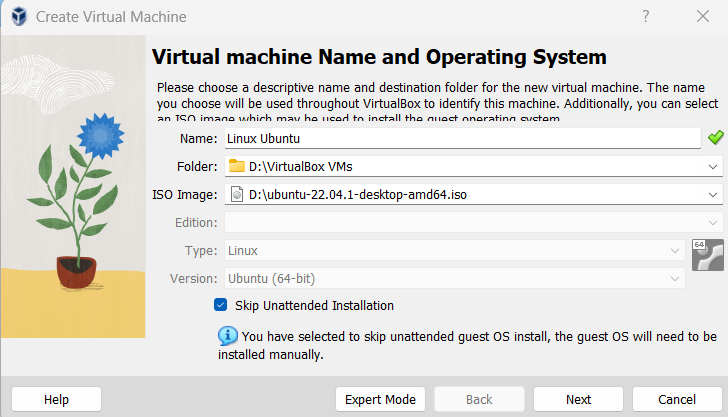

Linux VM
========

Problems with Linux VM
~~~~~~~~~~~~~~~~~~~~~~

Unable to open terminal on linux VM
-----------------------------------

Just install Linux with checked option ``Skip Unattended Installation``

How to set shared folder on Ubuntu Virtualbox
---------------------------------------------

`Virtualbox Shared Folder NOT Working - Fixed <https://www.youtube.com/watch?v=N4C5CeYfntE>`_  

::

    sudo apt-get update
    sudo apt-get install -y build-essential linux-headers-$(uname -r)
    sudo apt-get install virtualbox-guest-utils
    sudo adduser $(whoami) vboxsf

How to install VirtualBox Guest Additions on Linux
--------------------------------------------------

https://www.makeuseof.com/install-virtualbox-guest-additions-on-linux/