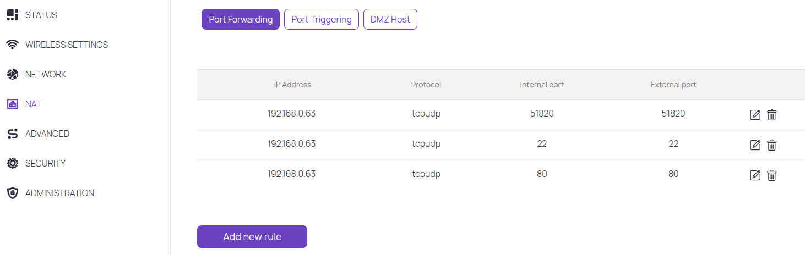

Port forwarding
===============

If you have public ip and want to access fro internet to your device you probably need to use port forwarding on your router. Check more info here: https://portforward.com/

It probably should be set like this:

But in my case it didnt worked :D
