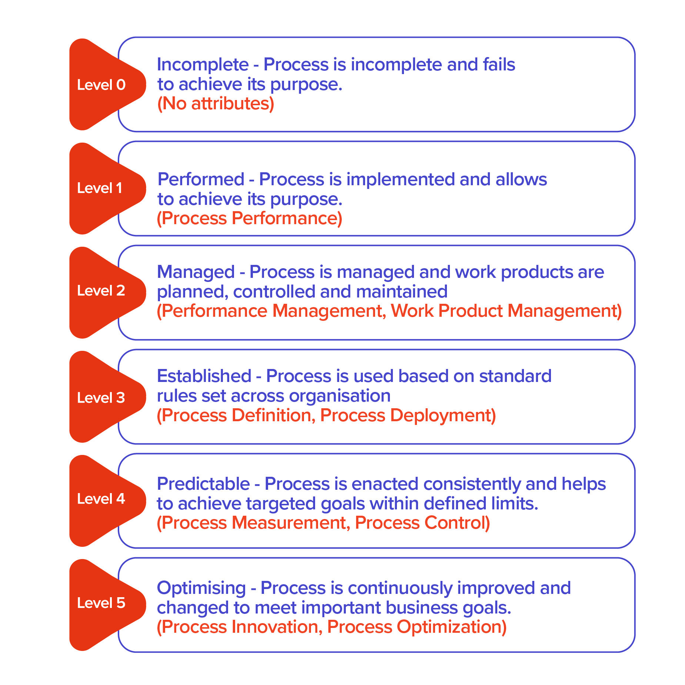
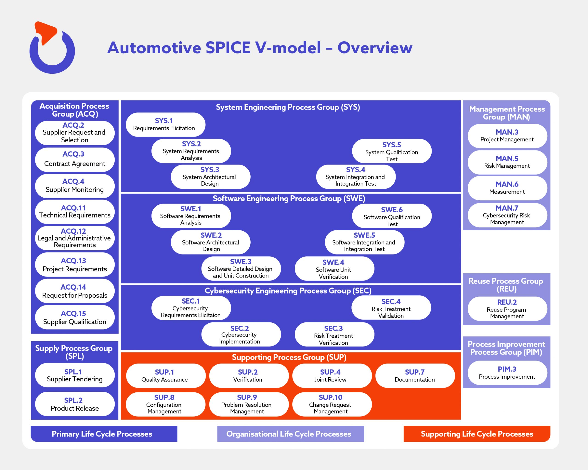

ASPICE
======

`Everything about Automotive SPICE <https://spyro-soft.com/aspice-101-a-guide-to-automotive-spice>`_ 

**Automotive Spice**, or **ASPICE** stand for **Automotive Software Process Improvement and Capability Determination**. It was created to assess the performance of the development processes of OEM ( Original Equipment Manufacturer ) suppliers in the automotive industry.
It was created to assess the performance of the development processes of OEM suppliers in the automotive industry.
It defines best practices and processes to ensure the highest quality of embedded automotive software development. The certification process is based on the audit conducted by external, independent ASPICE-certified assessors.

ASPICE capability levels
~~~~~~~~~~~~~~~~~~~~~~~~

Suppliers who undergo the ASPICE certification can be scored at one of five capability levels

ASPICE verification and validation model
~~~~~~~~~~~~~~~~~~~~~~~~~~~~~~~~~~~~~~~~

The verification and Validation model, also known as a V-model, is what Automotive SPICE builds on. The V-model is strict in its requirement for constant evaluation and development, so that potential issues can be eliminated at the first stage. The V-model consists of two stages. Each of them includes different phases, as illustrated in the graphic below.

Main 3 categories:

1. Primary life cycle processes
2. Organisational life cycle processes
3. Supporting life cycle processes

