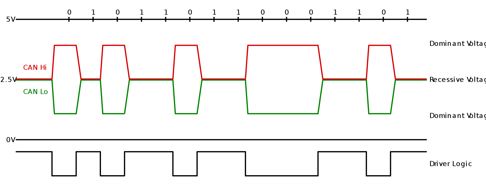

CAN bus
=======

Controller Area Network (CAN bus)

CAN history
~~~~~~~~~~~

- Bosch published several versions of the CAN specification and the latest is CAN 2.0 published in 1991
- A CAN device that uses 11-bit identifiers is commonly called CAN 2.0A and a CAN device that uses 29-bit identifiers is commonly called CAN 2.0B
- In 1993, ISO released the CAN standard ISO 11898 

CAN bus info
~~~~~~~~~~~~
- robust vehicle bus
- non hierarchical, mult i-master serial bus
- twisted pair connection for bi-directional data
- Up to 1 Mb/s

CAN bus classes
~~~~~~~~~~~~~~~
- A - 10kb/s
- B - 50kb/s
- C - 300kb/s - 1Mb/s
- D - 1Mb/s 

Voltage levels
~~~~~~~~~~~~~~

CAN arbitration
~~~~~~~~~~~~~~~

