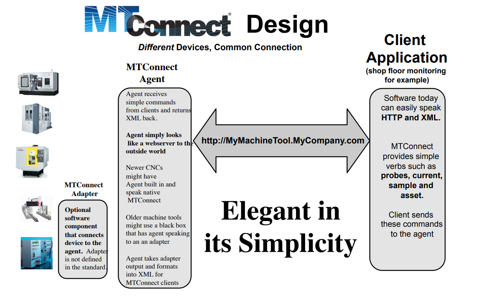

MT Connect
==========

`Getting started with MT Connect <https://mtcup.org/pdfs/GettingStartedWithMTConnectWritingClientsRevisionJuly2013.pdf>`_ 

`Presentation about MT Connect <https://mtcup.org/pdfs/GettingStartedWithMTConnectWritingClientsRevisionJuly2013.pdf>`_ 

`Remote MT server <https://smstestbed.nist.gov/vds/sample?count=1000>`_ 

`Haas documentation about MT Connect <https://www.haascnc.com/service/troubleshooting-and-how-to/how-to/machine-data-collection---ngc.html>`_ 

`Preparing MT connect simulator locally <https://github.com/mtconnect/cppagent/issues/115>`_ 

Getting data with curl from remote server::

    curl https://smstestbed.nist.gov/vds/sample?count=10

`How to integrate RapidXML with your C++ app <https://cpp0x.pl/artykuly/Inne-artykuly/C++-Obsluga-plikow-XML-biblioteka-RapidXML/50>`_ 

About MT connect
~~~~~~~~~~~~~~~~

To get data from MT server you should send a HTTP/HTTPS requests.

There are 4 kinds of XML responses:

- Devices

  - ``vds`` - name of device
  - ``probe`` - request type which get metadata
  - https://smstestbed.nist.gov/vds/probe
- Streams

  - Real-time stream of most current value for each data item: https://smstestbed.nist.gov/vds/current
  - Time series of most recent values collected for each data item: https://smstestbed.nist.gov/vds/sample
- Assets

  - Retrieve information on mobile assets 
- Error

  - Returned when an error occurs that prevents further processing 

More about that in ``Getting started with MT Connect``

