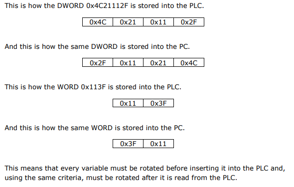
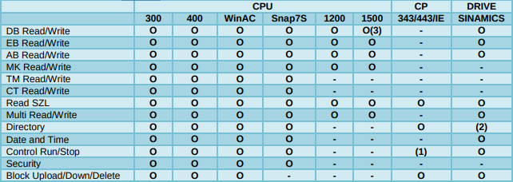
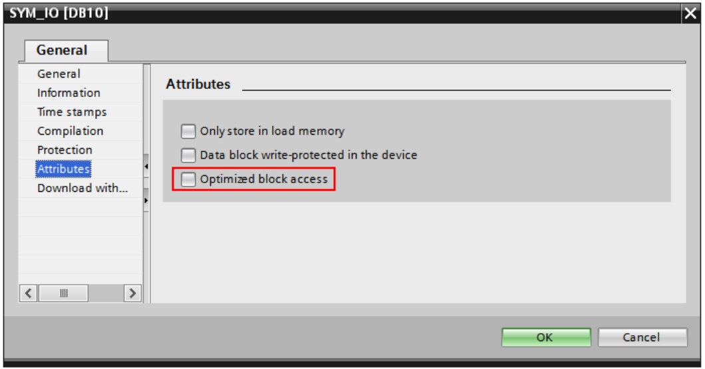
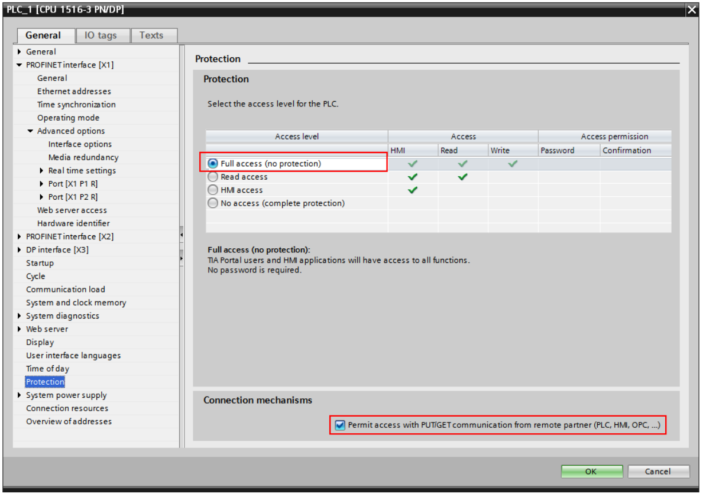

Snap7 library
=============

Source repository for snap7 is `on sourceforge <http://snap7.sourceforge.net/>`_ 

I created my own `mirror for snap7 on github <https://github.com/sebastianwach/snap7>`_ 

Whole doc is in main repository in doc/ folder

Licensing
~~~~~~~~~

Snap7 is distributed as a binary shared library with full source code under **GNU Library or Lesser General Public License version 3.0 (LGPLv3).**

Communication
~~~~~~~~~~~~~

Snap7, by design handles only Ethernet S7 Protocol communication on port 102(ISO TCP) and cannot be changed.

Siemens data format
~~~~~~~~~~~~~~~~~~~

The PLC internal data format is **Big-Endian**, i.e. the complex variable (which size is greater than 1 byte) are stored in memory starting from **MSB** (the most significant byte) up to **LSB** (least significant one)

The PC internal data format, except for some architectures as Sparc, Mips and Motorola 68000 systems based, is **Little-Endian**

.. important:: In case of problems with endian convention, you can use ``be64toh()`` etc.

Target compatibility
~~~~~~~~~~~~~~~~~~~~

S7 300/400/WinAC CPU
~~~~~~~~~~~~~~~~~~~~

They fully support the S7 Protocol

S7 1200/1500 CPU
~~~~~~~~~~~~~~~~

They use a modified S7 protocol with an extended telegram, 1500 series has advanced security functions (such an encrypted telegrams), however they can work in 300/400 compability mode and some functions can be executed.

An external equipment can access to S71200/1500 CPU using the S7 “base” protocol,
only working as an HMI, i.e. only basic data transfer are allowed.

All other PG operations (control/directory/etc..) must follow the extended protocol.

Prepare Siemens PLC for reading data with snap7 library
~~~~~~~~~~~~~~~~~~~~~~~~~~~~~~~~~~~~~~~~~~~~~~~~~~~~~~~

1. Set DBs as global
2. Turn off DBs ``Optimized block access``

3. Set ``Full access(no protection)`` and ``Connection mechanisms ( Permit access with PUT/GET...)`` 

.. important:: In case of activating OPC UA server, communication with S7 protocol probably will not work

S7 200/ LOGO OBA7
~~~~~~~~~~~~~~~~~

These PLC have a different approach. See S7 200 and LOGO chapters in doc for a detailes description about their use with Snap7.

SINAMICS Drives
~~~~~~~~~~~~~~~

It's possible to communicate with the internal CPU, for some models G120 for example) is also possible to change driver parameters

Capabilities of snap7 library for Client
~~~~~~~~~~~~~~~~~~~~~~~~~~~~~~~~~~~~~~~~

**The most important functions**

- `DBRead()` - read PLC DB 
- `ABRead()` - read PLC Process outputs 
- `EBRead()` - read PLC Process inputs
- `MBRead()` - read PLC Markers
- `TMRead()` - read PLC Timers
- `CTRead()` - read PLC Counters
- `GetLastError()` - Returns the last job result.
- `ErrorText()` - Returns a textual explanation of a given error number.

**Less important funcitons**

- Directory functions

  - `ListBlocks()` 		- Returns the AG blocks amount divided by type.
  - `ListBlocksOfType()`	- Returns the AG blocks list of a given type.
  - `GetAgBlockInfo()` 	- Returns detailed information about a block present in AG. (This function is very useful if you need to read or write data in a DB which you do not know the size in advance)
  - `GetPgBlockInfo()` 	- Returns detailed information about a block loaded in memory.

- Block oriented functions
  
  - `FullUpload()` 		- Uploads a block from AG with Header and Footer infos.
  - `Upload()` 			- Uploads a block from AG.
  - `Download()` 			- Download a block into AG.
  - `Delete()` 			- Delete a block into AG.
  - `DBGet()` 			- Uploads a DB from AG using DBRead.
  - `DBFill()` 			- Fills a DB in AG with a given byte.

- Date/Time functions

  - `GetPlcDateTime()` 	- Returns the PLC date/time.
  - `SetPlcDateTime()` 	- Sets the PLC date/time with a given value.
  - `SetPlcSystemDateTime()` - Sets the PLC date/time with the host (PC) date/time.

- System info functions
  
  - `ReadSZL()` - Reads a partial list of given ID and Index.
  - `ReadSZLList()` - Reads the list of partial lists available in the CPU.
  - `GetOrderCode()` - Returns the CPU order code.
  - `GetCpuInfo()` - Returns some information about the AG ( Module Type Name, Serial Number, AS Name, Copyright, Module Name )
  - `GetCpInfo()` - Returns some information about the CP (communication processor). ( Max PDU Lenght, Max Connections, Max MPI Rate, Max Bus Rate )

- PLC control functions

  - `PlcHotStart()` - Puts the CPU in RUN mode performing an HOT START.
  - `PlcColdStart()` - Puts the CPU in RUN mode performing a COLD START.
  - `PlcStop()` - Puts the CPU in STOP mode.
  - `CopyRamToRom()` - Performs the Copy Ram to Rom action.
  - `Compress()` - Performs the Compress action.
  - `GetPlcStatus()` - Returns the CPU status (running/stopped)

- Security functions

  - `SetSessionPassword()` - Send the password to the PLC to meet its security level.
  - `ClearSessionPassword()` - Clears the password set for the current session (logout).
  - `GetProtection()` - Gets the CPU protection level info. ( TS7Protection ):

    - Protection level set with the mode selector.
    - Password level, 0 : no password
    - Valid protection level of the CPU
    - Mode selector setting (1:RUN, 2:RUN-P, 3:STOP, 4:MRES, 0:undefined or cannot be determined)
    - Startup switch setting (1:CRST, 2:WRST, 0:undefined, does not exist of cannot be determined)

- Low level functions

  - `IsoExchangeBuffer()` - Exchanges a given S7 PDU (protocol data unit) with the CPU.

- Miscellaneous functions:

  - `GetExecTime()` - Returns the last job execution time in milliseconds.
  - `GetPduLength()` - Returns info about the PDU length (requested and negotiated).
  - `GetConnected()` - Returns the connection status of the client.

- Asynchronous functions, you can check them in `Snap7 Reference manual` on page 168. ( These functions are executed in a separate thread simultaneously to the execution of the caller program)
    

**Footnotes:**

1. `AG block` can be one of these: `OB`, `FB`, `DB` , etc
2. `SZL`(System-ZustandsListen) is the same as `SSL` (System Status List)

