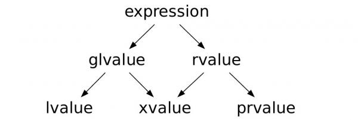

L-value vs r-value
==================

`AGH article about lvalue vs rvlaue <https://home.agh.edu.pl/~mbargiel/teaching/cpp/slides/cpp-slides.php>`_ 

Lvalues::

    foo() // zwracana wartość odnosi się do zmiennej statycznej 'i'.
    a // odnosi się do zmiennej 'a' można przypisać do zmiennej int&
    bar // odnosi się do zmiennej `bar`. zwracany typ to Bar&
    bar.m // odnosi się do pola `m` obiektu `bar`. Można przypisać do zmiennej  int&

Not lvalues::

    5 // nie odnosi się do żadnej istniejącej zmiennej.
    Bar{} // nie odnosi się do żadnej istniejącej zmiennej, lecz tworzy nową.
    std::move(a); // zwracany typ jest T&&, a nie T&