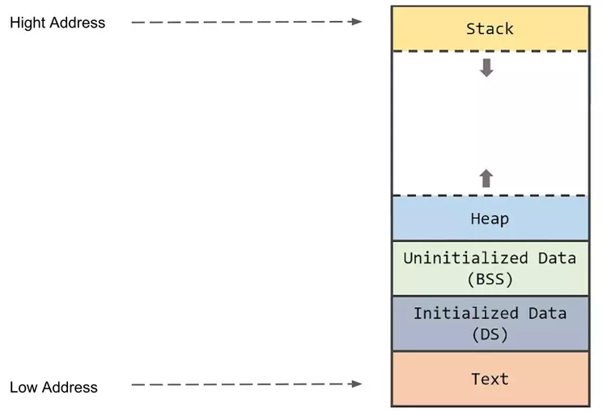
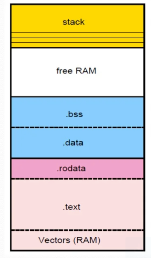

Memory in C++
=============

`Gynvael about process memory <https://www.youtube.com/watch?v=MM4hDpzFUcA&t=9223s>`_ 

C/C++ memory segments
~~~~~~~~~~~~~~~~~~~~~

A program is typically divide into different memory areas called segments:

- **Code Segment**. It is also called text segment where the compiled program sits in memory. The code segment is typically read-only 
- **Data Segment**. It is also called initialized data segment where initilized global and static variables are stored
- **BSS Segment (block starting symbol)**. It is also called the uninitialized data segment where zeroinitilaized global ans static variables are stored.
- **Heap**. It holds dynamically allocated variables
- **Stack**. It stores function parameters, local variables and other function-related information

Sections:

1. Read only:
    a) .text: Program code
    b) .rodata: constants ( const modifier ) and strings

2. Global and Static:
    a) .data: Initialized global and static variables
    b) .bss: Uninitialized global and static variables

3. Dynamic Memory. ( ``new``, ``malloc`` )

   - Allocating memory on the heap is comparatively slow
   - Allocated memory stays allocated until it is specifically deallocated ( neware memory leaks ) or the application ends ( at which point the OS should clean it up )
   - Dynamically allocated memoery must be accessed through a pointer. Dereferencing a pointer is sloswe than accessing a variable directly
   - Because the heap is a big pool of memory, large arrays, structures or classes can be allocated here

4. Call Stack, also known as ``stack``

   - Allocating memory on the stack is comparatively fast
   - Memory allocated on the stack stays in scope as long as it is on the stack. It is destroyed when it is popped off the stack
   - All memory allocated on the stack is known at compile time. Consequently, this memory can be accessed directly through a variable
   - Because the stack is relatively small, it is generally not a good idea to do anything that eats up lots of stack space. This inlcudes passing by a value or creating local variables of large arrays or other memory-intensive structures, it leads to stack Overflow.

.. important:: Why memory allocatin on the heap is slower?
    Because the heap is a far more complicated data structure than the stack.

    For many architectures, allocating memory on the stack is just a matter of changing the stack pointer, i.e. it's one instruction. Allocating memory on the heap involves looking for a big enough block, splitting it, and managing the "book-keeping" that allows things like free() in a different order.

    Memory allocated on the stack is guaranteed to be deallocated when the scope (typically the function) exits, and it's not possible to deallocate just some of it.

.. important:: 1. When stack collide with heap. It is stack clash
    2. Each thread has its own stack and it is limited depend on platform ( Linux to nearly 8MB, Windows to 2MB )
    3. ``const`` keyword only indicate that it should/can be put in .rodata section
    4. ``tls`` - thread local storage. In C++ ``thread_local`` keyword for global variable

.. code-block:: cpp

    #include <iostream>

    int a = 0x12345678; // -> .data
    const unsigned int b = 0xabababab; // -> .rodata

    int main() 
    {   
        puts("hello world!"); // "hello world!" - > .rodata

        return 0;
    }

1. It this case a global array as a result makes binary +64MB::

    int a[16* 1024 * 1024 ] = { 0x12345678 } // -> .data

2. In this case it doesn't increase binary size like before. E.g 17kB::

    int a[16* 1024 * 1024 ]; // -> .bss

3. In this case it will increase a little bit. e.g 33kB, but not 65MB. This additional +16kB is due to initilized first value of array

.. code-block:: cpp

    #include <cstdio>

    int main()
    {
        static int b[0x1000] = {0x12345678};
    }

Process contigous virtual memory
~~~~~~~~~~~~~~~~~~~~~~~~~~~~~~~~

`Stack overflow about /proc/$PID/maps <https://stackoverflow.com/questions/1401359/understanding-linux-proc-pid-maps-or-proc-self-maps>`_ 

::

    cat /proc/$PID/maps
    # or with ``self`` for current ``cat`` process
    cat /proc/self/maps

Read raw data from different proces
~~~~~~~~~~~~~~~~~~~~~~~~~~~~~~~~~~~

.. code-block:: cpp

    #include <iostream>

    const char* x = "hello world";

    int main()
    {
        puts( x );
        printf("%p\n", x );
        getchar();
    }

Output::

    hello world
    0x55a216ba600c

In the second terminal::

    ps aux | grep ./build/app
    # user+  268354  0.0  0.0   6036  1572 pts/10   S+   18:35   0:00 ./build/app
    268354 is app PID
    cat /proc/268354/maps

Read this data from different terminal:

.. code-block:: python

    #!/usr/bin/python3
    f = open("/proc/268354/mem", "rb" )
    f.seek(0x55a216ba600c)
    print(f.read(11))
    # Output: b'hello world'