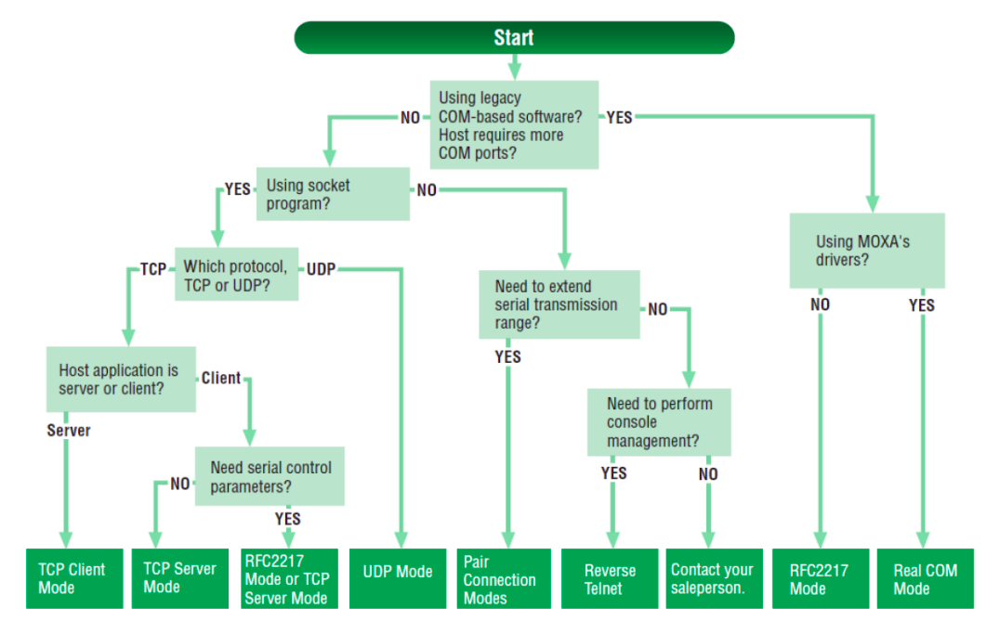
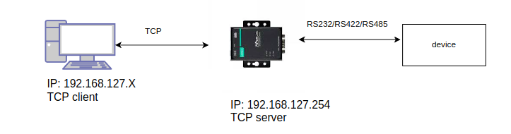
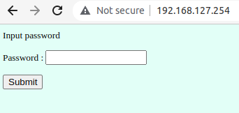
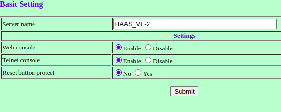
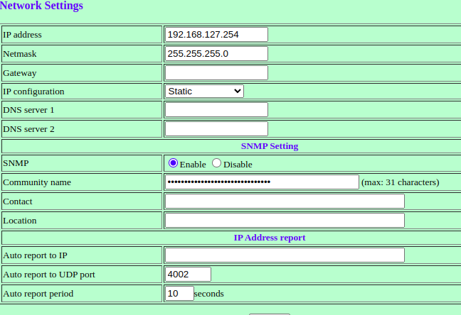
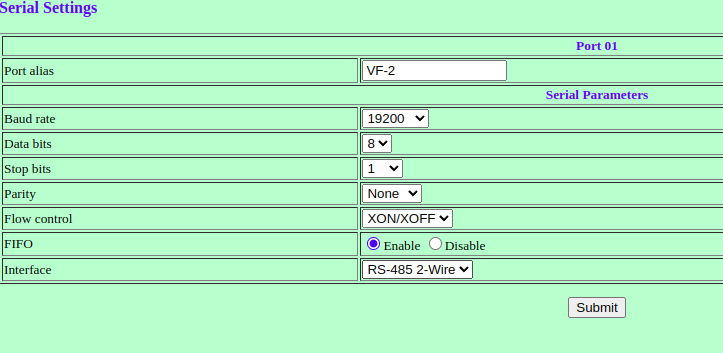
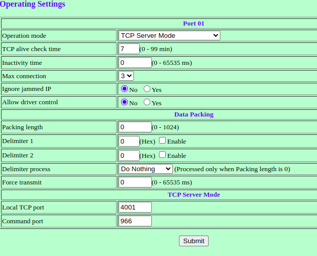
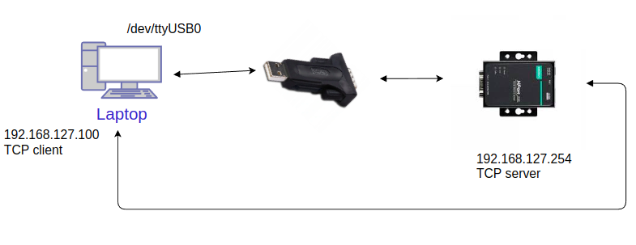

How to set MOXA NPORT 5150
==========================

Available MOXA NPORT 5150 modes
~~~~~~~~~~~~~~~~~~~~~~~~~~~~~~~

- Real Mode
- RFC2217
- TCP Server
- TCP Client
- UDP
- Pair Connection 
- Ethernet Modem
- Reverse Telnet
- PPP
- Disabled

Which one choose?

Preparing MOXA as TCP server
~~~~~~~~~~~~~~~~~~~~~~~~~~~~

In this mode you should connect device as it is shown on image below

    

Moxa configuration
------------------

You can configure MOXA NPort 5150 by:

- Windows Utility
- Web Console
- Telnet Console
- Serial Console

In this tutorial we will cover how to set device with web console. To start we should connect MOXA and device as it was described above :ref:`Preparing MOXA as TCP server`

1. Login in web console

Default password: ``moxa``

2. Set basic settings in: Main menu->Basic setting 

3. Network settings

You can set different IP from subnet, static/dhcp. On picture are default values

4. Serial Port

Go to Serial Port -> Port 1. Set according to your device. In this case it was prepared for RS485

5. Operating settings

Set:

- Operation mode: ``TCP Server Mode``
- Max Connection e.g.: ``3``
- Local TCP port: ``4001``

6. Save changes

Finally, go to the Save/Restart page and Submit.

Verify communication with MOXA NP 5150
~~~~~~~~~~~~~~~~~~~~~~~~~~~~~~~~~~~~~~

Prepare deivice in such configuration:

Python responding script
------------------------

.. code-block:: python

    #!/usr/bin/python3

    import serial, time

    ser = serial.Serial(port='/dev/ttyUSB0',\
                        baudrate=19200,\
                        parity=serial.PARITY_NONE,\
                        stopbits=serial.STOPBITS_ONE,\
                        bytesize=serial.EIGHTBITS, \
                        xonxoff=True,
                        timeout=0.1 )

    # `\n` -> eol sign

    buf = ""

    while 1:
        read = ser.read(100)
        buf = str(read.decode("utf-8"))
        if buf:
            print(buf)
            if buf == "Q500":
                print( "Sending: STATUS, BUSY")
                ser.write(b'STATUS, BUSY')

Cpp with requests code
----------------------

.. code-block:: cpp

    // Client side C/C++ program to demonstrate Socket programming
    #include <arpa/inet.h>
    #include <iostream>
    #include <string>
    #include <sys/socket.h>
    #include <thread>
    #include <unistd.h>

    const std::string IP = "192.168.127.254";
    const uint16_t Port = 4001;

    int main( int argc, char const *argv[] )
    {
        int socket_fd = 0;
        
        struct sockaddr_in serv_addr;
        char buffer[ 1024 ] = { 0 };
        if( ( socket_fd = socket( AF_INET, SOCK_STREAM, 0 ) ) < 0 )
        {
            printf( "\n Socket creation error \n" );
            return -1;
        }

        serv_addr.sin_family = AF_INET;
        serv_addr.sin_port = htons( Port );

        // Convert IPv4 and IPv6 addresses from text to binary form
        if( inet_pton( AF_INET, IP.c_str(), &serv_addr.sin_addr ) <= 0 )
        {
            printf( "\nInvalid address/ Address not supported \n" );
            return -1;
        }

        if( connect( socket_fd, ( struct sockaddr * ) &serv_addr, sizeof( serv_addr ) ) < 0 )
        {
            printf( "\nConnection Failed \n" );
            return -1;
        }

        std::string lRequestMessage;

        while( 1 )
        {
            std::cout << "Request: ";
            std::cin >> lRequestMessage;
            send( socket_fd, lRequestMessage.c_str(), lRequestMessage.length(), 0 );

            int lReadRet;
            lReadRet = read( socket_fd, buffer, 1024 );
            if( lReadRet != 0 )
            {
                std::string lResponse = buffer;
                std::cout << "Received: " << lResponse << std::endl;
            }
        }

        return 0;
    }

Run python script::
    
    ./serial_read.py

Compile and run cpp code::

    ./app
    # Pass Q500 as an input and receive STATUS, BUSY from python script
    Request: Q500
    Received: STATUS, BUSY

