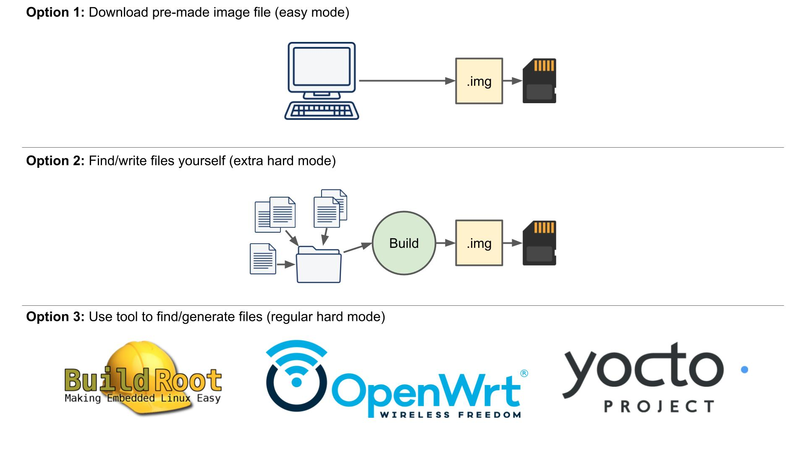

BuildRoot OpenWrt and Yocto comparison
======================================

`Article <https://www.digikey.com/en/maker/projects/intro-to-embedded-linux-part-1-buildroot/a73a56de62444610a2187cd9e681c3f2>`_
about introduction to Embedded Linux. `Here <https://www.youtube.com/watch?v=9vsu67uMcko&list=PLEBQazB0HUyTpoJoZecRK6PpDG31Y7RPB>`_
on Youtube

Different ways to obtain embedded linux image
~~~~~~~~~~~~~~~~~~~~~~~~~~~~~~~~~~~~~~~~~~~~~

**BuilRoot**
    - Easy to use
    - Limited configuration settings
    - Requires full image rebuild (each time you make changes)

**OpenWrt**
    - Focused on networking gear (e.g. routers)
    - Package-based updates

**Yocto**
    - Steep learning curve
    - Customizable
    - Active community

