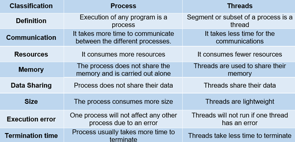

Process vs thread in Linux
==========================

Process definition
~~~~~~~~~~~~~~~~~~

Processes are basically the programs that are dispatched from the ready state and are scheduled in the CPU for execution. PCB(Process Control Block) holds the concept of process.
A process can create other processes which are knowns as Child Processes.
The process takes more time to terminate and it is isolated means it does not share the momory with any other process.

The process can have the following states:

- new
- ready
- running
- waiting
- terminated
- suspended

Thread
~~~~~~

Thread is the segment od a process which means a process can have multiple threads and these multiple threads are contained within a process. 

A thread has three states:

- running
- ready
- blocked

Difference between Process and Thread
~~~~~~~~~~~~~~~~~~~~~~~~~~~~~~~~~~~~~

