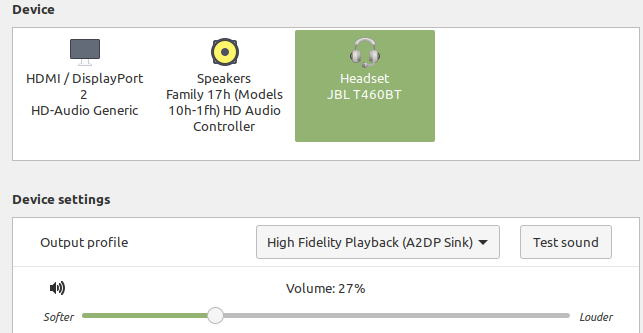

Pulseaudio
==========

Sometimes due to skype or some apps on linux pulseaudio is crashing and then is problem 
with connecting wireless headset. In this case it isn't possible to set a output profile **High Fidelity Plaback (A2DP Sink)**

In sound manager it should be visible like here:

Otherwise when quality is very poor it is set as here:

Problem occurs when it is unable to switch back to **A2DP Sink** and in ``dmesg`` are visible errors like here::

    [21919.890181] Bluetooth: hci0: SCO packet for unknown connection handle 0
    [21919.890183] Bluetooth: hci0: SCO packet for unknown connection handle 0
    [21919.900028] Bluetooth: hci0: SCO packet for unknown connection handle 0
    [21919.900034] Bluetooth: hci0: SCO packet for unknown connection handle 0
    [21919.900036] Bluetooth: hci0: SCO packet for unknown connection handle 0
    [21919.900037] Bluetooth: hci0: SCO packet for unknown connection handle 0
    [21919.900038] Bluetooth: hci0: SCO packet for unknown connection handle 0
    [21919.900040] Bluetooth: hci0: SCO packet for unknown connection handle 0

To solve this problem you can restart pulseaudio service

Restart pulseaudio
~~~~~~~~~~~~~~~~~~

Check pulseaudio status
-----------------------

::

    pulseaudio --check

It normally prints no output, just exit code. 0 means running. Mine were not running, so I just advanced to step :ref:`Start pulseaudio daemon`  .

Kill running pulseaudio daemon
------------------------------

::

    pulseaudio -k

Start pulseaudio daemon
-----------------------

::

    pulseaudio -D
