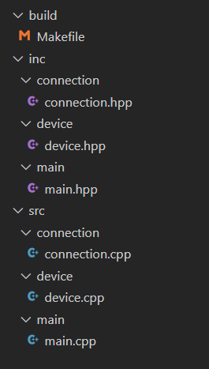

Makefile tips, knowledge in a nuthsell
======================================

All knowledge about GNU Makefile `link <https://www.gnu.org/software/make/manual/html_node/index.html#SEC_Contents>`_ 

Nice, short tutorial to repeat knowledge about makefiles
`Practical makefiles, by example <http://nuclear.mutantstargoat.com/articles/make/>`_ 

`Cool, more complex makefile example  <https://riptutorial.com/makefile/example/21376/building-from-different-source-folders-to-different-target-folders>`_ 

.. note:: 
    1. typing ``make`` means: build the first rule in the makefile
    2. To write prerequisities, recipes in multiple lines ``\`` on the end of line is used
    3. ``@`` is a built-in make variable containing the target of each rule
    4. ``^`` is another built-in variable containing all the dependencies of each rule
    5. ``<`` is a variable which contains only the first element of the dependencies
    6. ``@`` at the beginning of the recipe it will not print executed command
    7. If ``obj = main.o game.o level.o ...`` then to substitute longer names it is a must to use ``$(obj)``. If we instead tried to use ``$obj`` then make would try to expand a variable named ``o``, and then append the string ``bj`` to the result.
    8. ``PROJDIR := $(realpath $(CURDIR)/..)`` thanks to realpath we get ``E:/Cpp/`` instead of ``E:/Cpp/build/..``
    9. ``DIRS_PATH = $(wildcard $(SOURCEDIR)/*/)`` gets all absolute path of all folders inside ``SOURCEDIR``
    10. ``DIRS  = $(foreach dir,  $(DIRS_PATH), $(shell basename $(dir)) )`` gets basename of folders from path in ``DIRS_PATH``

Not elegant make
~~~~~~~~~~~~~~~~

.. code-block:: Makefile

    CXX = g++
    TARGET = thread
    FLAGS = -g -Wall -std=c++17
    INCLUDE = inc/

    all: thread.o connection.o device.o
        $(CXX) $(FLAGS) -o $(TARGET) $(TARGET).o connection.o device.o -I $(INCLUDE)

    thread.o: thread.cpp
        $(CXX) -c thread.cpp

    device.o: ./src/device.cpp
        $(CXX) -c ./src/device.cpp -I $(INCLUDE)

    connection.o: ./src/connection.cpp
        $(CXX) -c ./src/connection.cpp -I $(INCLUDE)

    clean: 
        rm thread.exe
        rm *.o

Simpler makefile
~~~~~~~~~~~~~~~~

.. code-block:: Makefile

    CXX = g++
    TARGET = thread
    FLAGS = -g -Wall -std=c++17
    INCLUDE = inc/

    all: thread.o connection.o device.o
        $(CXX) $(FLAGS) -o $(TARGET) $^ -I $(INCLUDE)

    thread.o: thread.cpp
        $(CXX) -c thread.cpp

    device.o: ./src/device.cpp
        $(CXX) -c ./src/device.cpp -I $(INCLUDE)

    connection.o: ./src/connection.cpp
        $(CXX) -c ./src/connection.cpp -I $(INCLUDE)

    clean: 
        rm -rf $(TARGET).exe
        rm -rf *.o

Nice, generic Makefile
~~~~~~~~~~~~~~~~~~~~~~

For such proj structure you can use makefile listed below

.. code-block:: Makefile
    
    # Compiler options
    CXX = g++
    TARGET = thread
    FLAGS = -g -Wall -std=c++17

    # Set project directory one level above of Makefile directory. $(CURDIR) is a GNU make variable containing the path to the current working directory
    PROJDIR := $(realpath $(CURDIR)/..)
    SOURCEDIR := $(PROJDIR)/src
    INCLUDEDIR := $(PROJDIR)/inc
    BUILDDIR := $(PROJDIR)/build

    # Decide whether the commands will be shown or not
    VERBOSE = TRUE

    # Create the list of directories
    DIRS_PATH = $(wildcard $(SOURCEDIR)/*/)
    DIRS  = $(foreach dir,  $(DIRS_PATH), $(shell basename $(dir)) )
    SOURCEDIRS = $(foreach dir, $(DIRS), $(addprefix $(SOURCEDIR)/, $(dir)))
    INCLUDEDIRS = $(foreach dir, $(DIRS), $(addprefix $(INCLUDEDIR)/, $(dir)))
    TARGETDIRS = $(foreach dir, $(DIRS), $(addprefix $(BUILDDIR)/, $(dir)))

    # Generate the g++ includes parameters by adding -I before each source folder
    INCLUDE = $(foreach dir, $(INCLUDEDIRS), $(addprefix -I, $(dir)))

    # Add this list to VPATH, the place make will look for the source files
    VPATH = $(SOURCEDIRS)

    # Create a list of *.cpp sources in DIRS
    SOURCES = $(foreach dir,$(SOURCEDIRS),$(wildcard $(dir)/*.cpp))

    # Define objects for all sources
    OBJS := $(subst $(SOURCEDIR),$(BUILDDIR),$(SOURCES:.cpp=.o))

    # Define dependencies files for all objects
    DEPS = $(OBJS:.o=.d)

    # OS specific part( works on unix-like systems )
    RM = rm -rf 
    RMDIR = rm -rf 
    MKDIR = mkdir -p
    ERRIGNORE = 2>/dev/null
    SEP=/

    # Remove space after separator
    PSEP = $(strip $(SEP))

    # Hide or not the calls depending of VERBOSE
    ifeq ($(VERBOSE),TRUE)
        HIDE =  
    else
        HIDE = @
    endif

    # Define the function that will generate each rule
    define generateRules
    $(1)/%.o: %.cpp
        @echo Building $$@
        $(HIDE)$(CXX) $(FLAGS) -c $$(INCLUDES) -o $$(subst /,$$(PSEP),$$@) $$(subst /,$$(PSEP),$$<) $(INCLUDE) 
    endef

    .PHONY: all clean directories 

    all: directories $(TARGET)

    $(TARGET): $(OBJS)
        $(HIDE)echo Linking $@
        $(HIDE)$(CXX) $(FLAGS) $(OBJS) -o $(TARGET)

    # Include dependencies
    -include $(DEPS)

    # Generate rules
    $(foreach targetdir, $(TARGETDIRS), $(eval $(call generateRules, $(targetdir))))

    directories: 
        $(HIDE)$(MKDIR) $(subst /,$(PSEP),$(TARGETDIRS)) $(ERRIGNORE)

    # Remove all objects, dependencies and executable files generated during the build
    clean:
        $(HIDE)$(RMDIR) $(subst /,$(PSEP),$(TARGETDIRS)) $(ERRIGNORE)
        $(HIDE)$(RM) $(TARGET) $(ERRIGNORE)
        @echo Cleaning done !

How to use this Makefile
1. Change ``TARGET`` variable to match target name
2. If needed, adjust ``src/`` ``inc/`` ``build/`` dirs in ``SOURCEDIR`` ``INCLUDEDIR`` ``BUILDDIR`` 
3. Change directory to build/ ``cd build`` 
4. Run make ``make all``
