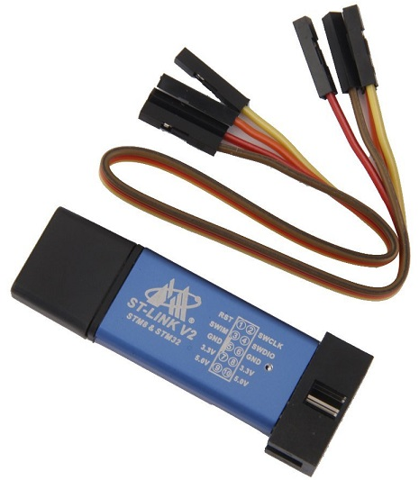
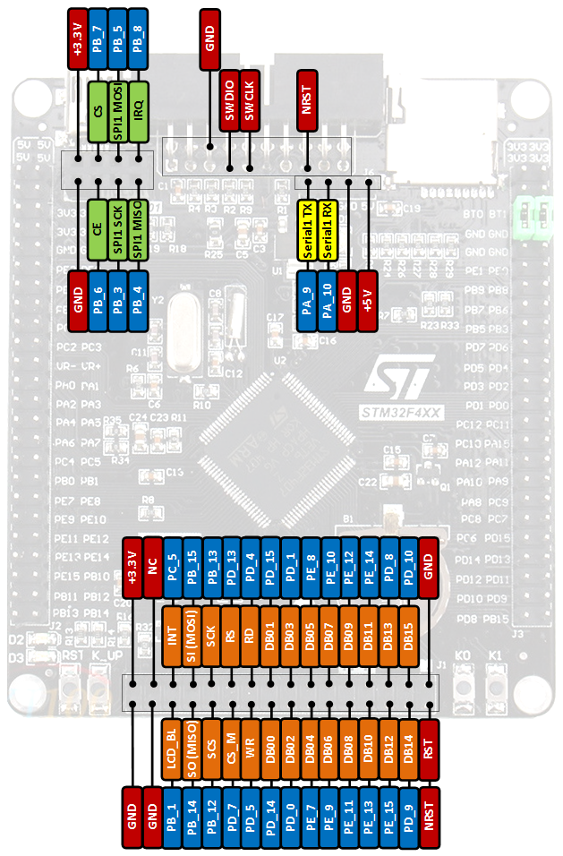

ST-LINK
=======

How to connect ST-LINK V2 to STM32F407VET6 black board
~~~~~~~~~~~~~~~~~~~~~~~~~~~~~~~~~~~~~~~~~~~~~~~~~~~~~~
`Board STM32F407VET6 pinout <https://os.mbed.com/users/hudakz/code/STM32F407VET6_Hello/shortlog/>`_

1. Connect SWCLK, SWDIO, GND and 3.3V (2,4,6,8) jumpers to ST-LINK
2. Connect it with SWDIO, SWCLK, GND and 3.3V(on the top right) on STM32 board
3. On STM32F407VET6 board connect BT0 and BT1 to GND ( use jumpers)
4. Flash with ST-LINK utility